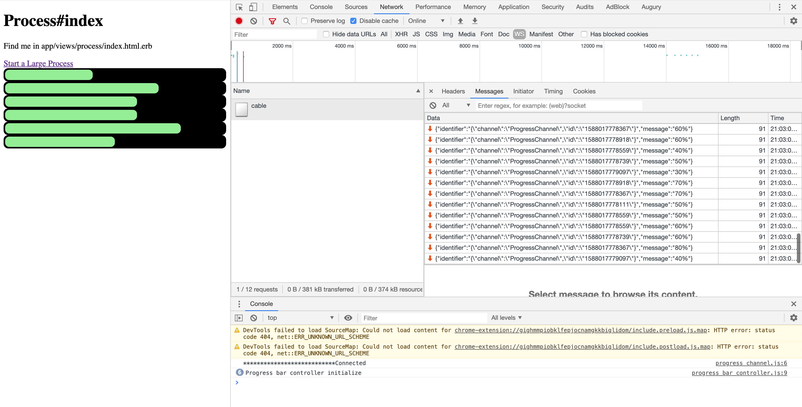
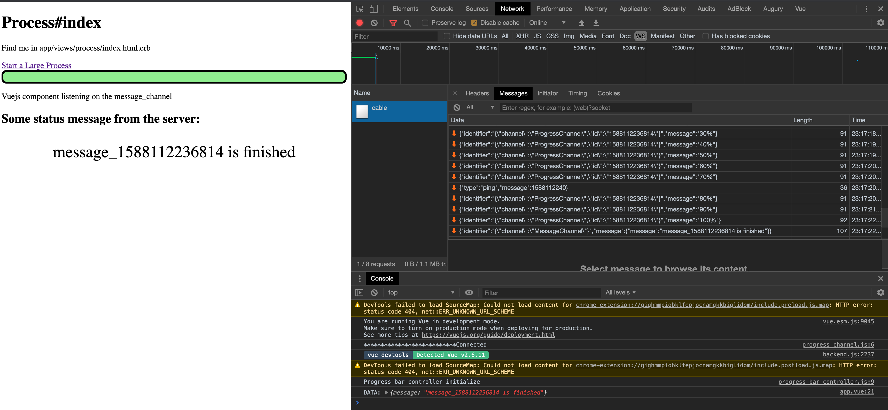

Rails UJS - makes ajax request
ActiveJob - runs the long task in the background
ActionCable - Provides updates to the client
SimulusJS - handles establishing the connection with actioncable

Added a Vue.js component that is subscribed to the messages websocket.
* Displays a message when the background job makes an announcement on the channel.
* uses computed property to dynamically update the value of the messages as they come in.

